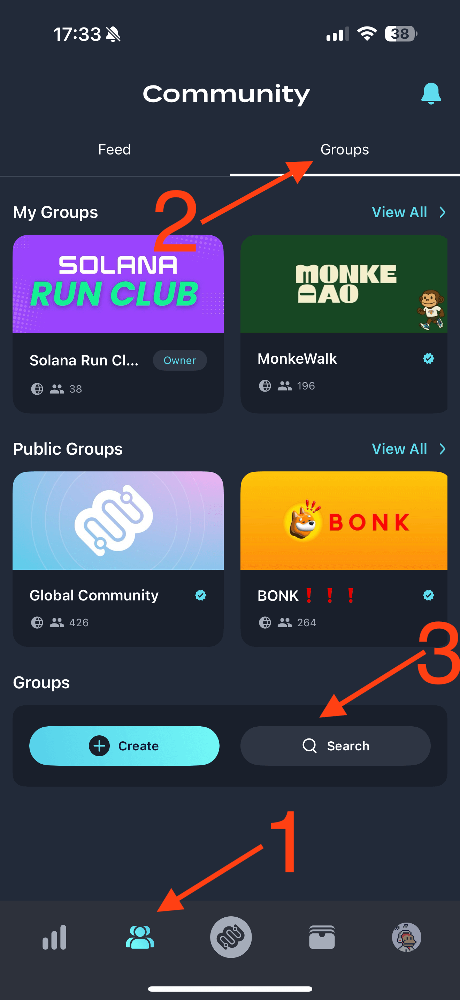

+++
date = '2025-07-12T16:25:37+01:00'
draft = false
title = 'Solana Run Club: 13th July 2025'
+++

Hi everyone 👋

Join our [next Solana Run Club](https://lu.ma/a2qjuep3) event on **Sunday, 13th July 2025** at **10:00 AM** in **Hyde Park, London**! 🏃‍♂️🏃‍♀️

We'll meet next to the drinking fountain near the **Marble Arch** entrance:

📍 [Meeting point on Google Maps](https://maps.app.goo.gl/xizjngNUfJ9XKtLK8)

📍 [Meeting point on W3W: ///noisy.demand.keeps](https://w3w.co/noisy.demand.keeps)

💬 Join our group chat: [https://t.me/+Waa0r643MbFiNDIy](https://t.me/+Waa0r643MbFiNDIy)

Please arrive on time and bring your own water bottle! 💧 You'll have a chance to refill it at the drinking fountain.

We'll run 5K (~30 minutes) at a comfortable pace, followed by a picnic in the park sponsored by [SuperteamUK](https://uk.superteam.fun) 🍕

Live location will be shared in the group chat and on Luma for those joining us later.

## Walk to win $500!

Our friends at [Moonwalk](https://moonwalk.fit) are sponsoring a challenge running from **Monday, 14th July through Wednesday, 16th July**.

All you need to do is walk 7,000 steps each day to win a share of the $500 prize pool! 🏆

The challenge is open to all of you for FREE.

To participate, simply download the Moonwalk app and join the game:

1. Download the app for [iOS](https://apps.apple.com/us/app/moonwalk-fitness/id6692608601) or [Android](https://play.google.com/store/apps/details?id=fit.moonwalk.mobile.app)

2. Create an account and use Alex's referral code (4drrcq5f). I recommend signing up with your Solana wallet.

3. Connect your step tracker: Apple Health, Google Fit, or Fitbit. It may take some time for the app to sync your steps, don't worry if you don't see them immediately.

4. Join [Solana Run Club](https://app.moonwalk.fit/community/4d642e90-f694-4561-8af9-e13bf468ed7c) on Moonwalk

If the link doesn't work, tap on the community tab, tap Groups and search for "Solana Run Club" to join, and finally tap "Join"

5. Join the game by tapping on "Games", then "Join" and select **Continue** under **Play for free**. Keep in mind that if tap "Join game for free" you will join as a spectator and won't be able to win the prize pool.



6. You will see "Depositing" badge which will shortly change to "Soon" and then "Active"

You if you need any help, reach out to [Moonwalk support](https://t.me/MoonwalkSupportBot) or ask in our group chat.

> Moonwalk helps you stay accountable to your fitness goals: pledge a small amount of SOL, USDC or BONK and get rewarded for staying active. Hitting your daily step goals protects your deposit, while missing them forfeits a portion to a prize pool shared among the most consistent players at the end of the game.
